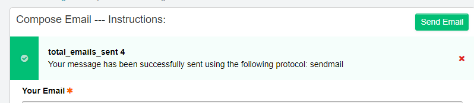
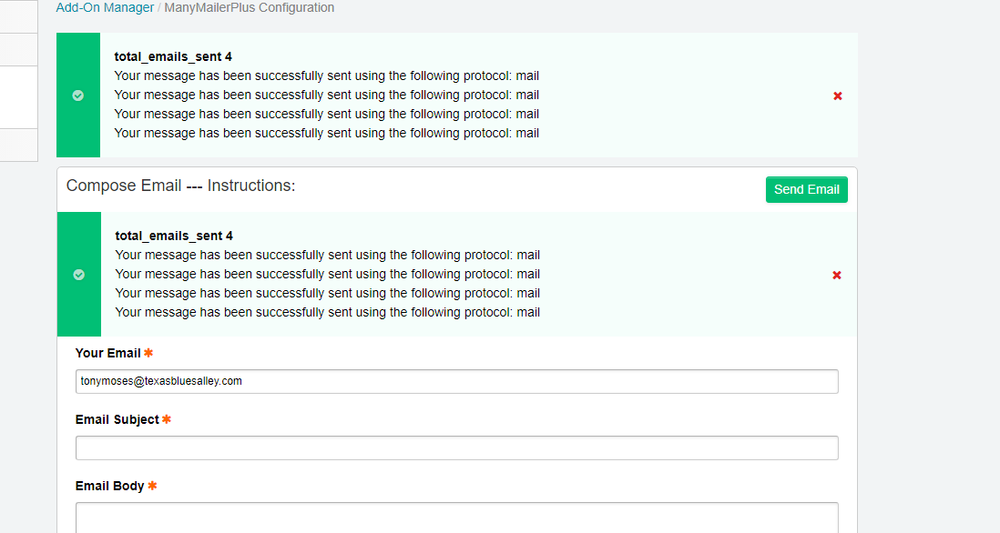

# ManyMailerPlus

All notable changes to this project will be documented in this file.

The format is based on [Keep a Changelog](https://keepachangelog.com/) and this project adheres to [Semantic Versioning](https://semver.org/).

## ChangeLog

## [0.1.5] - 2019-03-14

- Beta release

  - Current Release has the ability to:

    - send emails
    - view sent mail
    - separate template/actual emails in log

## [0.1.3] - 2019-02-27 ***`committed (9516df4) 3 changed files`***

Updates to README and CHANGELOG

## [0.1.3] - 2019-02-27 ***`committed (260e3bc8) 8 changed files`***

### Milestones

- Enable resending 'individual' emails

### TODO

- [ ] find a way to recreate "template" email state

## [0.1.21] - 2019-02-26 ***`committed (2d88c9a) 4 changed files`***

- include external js files for better ui
- hijacked default "View Email" modal

- human readable time in email modal

## [0.1.2] - 2019-02-26 ***`many commits`***

Recovery from git fumble

## [0.1.1] - 2019-02-21 ***`committed (2430d52) 13 changed files`***

### Minor Fixes

- Started documentation
- fixed minor page render on nav to settings page
- minor changes to config files
- enabled mailing services
- MessageArray Class now iterable

### TODO/Bug

Figure out why sending email crashes had to comment out following code from compser.php

```//  Send a single email
    if (count($groups) == 0)
    {
        $debug_msg = $this->deliverOneEmail($email, $recipient);
        ee()->view->set_message('success', lang('email_sent_message'), $debug_msg, TRUE);
        ee()->functions->redirect(
            ee('CP/URL',EXT_SETTINGS_PATH.'/email:compose')
        );
    }
```

### *Wishlist*

- [ ] test for duplicate emails
- [ ] test for batch processing
- [ ] CSV formatting
  - column mapping
- handle CSV with no header
- using placeholder
- [ ] better styling
- [ ] better sidebar (jquery)
- [ ] handle mobile

---

## [0.1.1] - 2019-02-21 ***`committed (b4e8596) 14 changed files`***

### Milestone

- Able to view cached emails
- Maintaining lang file updates

### Todo

- [ ] fix email management funcs

### Added

- [x] styling for placeholder on compose page

### Changed

- config\sidebar.php
  - temporarily disabled services functions

### Removed

- View files:
  - csv-field.php (deprecated)
  - sidebar_view.php (deprecated)

### Fixed

- [x] Double success bug
  - 

---

## [v0.1.0] - 2019-02-20 ***`committed (5b537c7) 18 changed files`***

- [x] emails successfully
- [x] upload csv
- [x] paste csv
- [x] parse emails from csv
- [x] creates placeholder buttons
- [x] sends email replacing placeholders

### Todo (functionality)

- [ ] Get working sent page with resend functionality
- [ ] update lang file

### Bugs

- double message on compose page

  - 