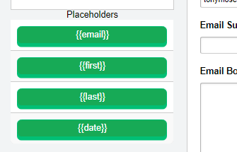
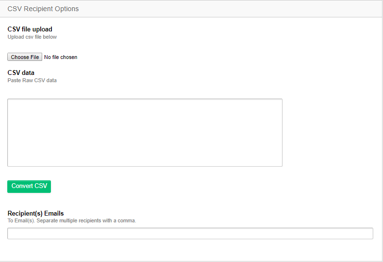
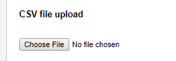
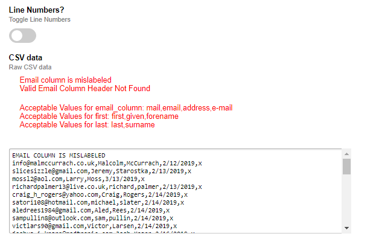
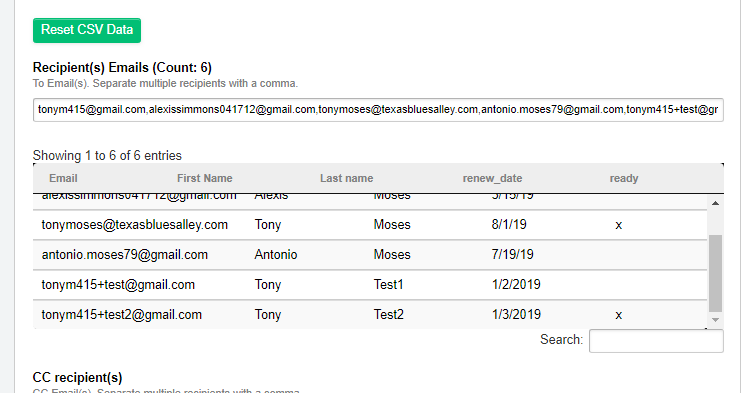

# ManyMailerPlus

## Welcome to ManyMailerPlus

This ExpressionEngine extension/module allows you to send custom emails (using placeholders)

)

to send emails to a list of people using a csv list!
The email form is based on the native 'Communicate' utility with a new enhancement of the 'Recipent Options':

### Installation

Move the 'manymailerplus' folder to the *./system/user/addons* directory

### Usage

#### Entry Methods

##### CSV (Upload)

Enables uploads of local file

##### CSV (Raw)

This method accepts a pasted CSV file. After pressing the "Convert" button the pasted text will be verified.
If the csv file is a valid email listing, the results(see below) will be posted to the page. on a table to be
reviewed and the harvested emails will be inserted into the "Recipients Emails" textbox[^1].

Any errors validate the data are prominently displayed along with suggestions for fixes

##### CSV Results

### Required Columns

#### Email Column

- Column title is some form of the following string(email, mail, e-mail, address)

#### First Name Column

- Column title is some form of the following string(first, given, forename)

#### Last Name Column

- Column title is some form of the following string(last, surname)

### Optional Columns

All other columns will be automatically injested to create tokenized placeholder buttons for use during email composition.

[^1]: Recipient Emails textbox is disabled by default

## Changelog

### [1.0.0] - 2019-03-22 - ManyMailerPlus v1.0

- commited 20 files [(98e948b)](https://github.com/StolenThunda/manymailerplus/commit/98e948bc35c1678b03a0e3e970e5cca6b681f693)
- converted extension to module
- added new view for module
- fixed bug in debug_helper to refer to the last class it can find to output

### [0.1.5] - 2019-03-14 - Beta release

Current Release has the ability to:

- send emails
- view sent mail
- separate template/actual emails in log
