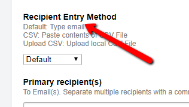
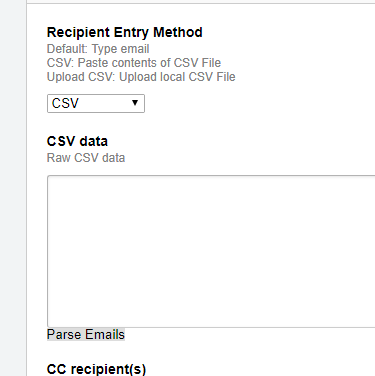
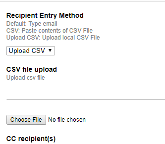

# ManyMailerPlus

## Welcome to ManyMailerPlus

This extension allows you to send custom emails (using placeholders) to send emails to a list of people using a csv list!
The email for is pretty much the same as the native 'Communicate' utility with a new enhancement of the 'Recipent Entry Method':

*Default refers to typing in the 'Primary Recipients' textbox*

### CSV entry method

This method accepts a pasted CSV file. After pasting

### CSV Upload method

